From websites
- https://medium.com/data-science/reinforcement-learning-explained-visually-part-5-deep-q-networks-step-by-step-5a5317197f4b 
**Deep Q Network**

Why we use a neural network?
* Q-table has limitations -> number of states are too huge to build a table 
* using a Q-function, f(state, action)->Q_value
* Neural nets: best function approximator (complex functions)
* it is a standard Neural Network Architecture

How it works
* f(S) -> Q-values of all the actions that can be taken from that state
* Q network: Agent that is trained to produce the Optimal State-Action value
1. starts with arbitary Q-value estimates
2. exlores the environment using epsilon-greedy policy

**DQN Architecture Components**
- 2 neural nets: Q network, Target Network, Experience Replay

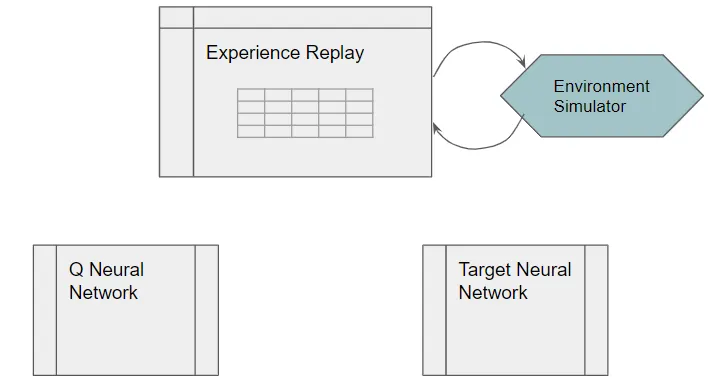<i>Relationship between components</i>

**High level DQN Workflow**
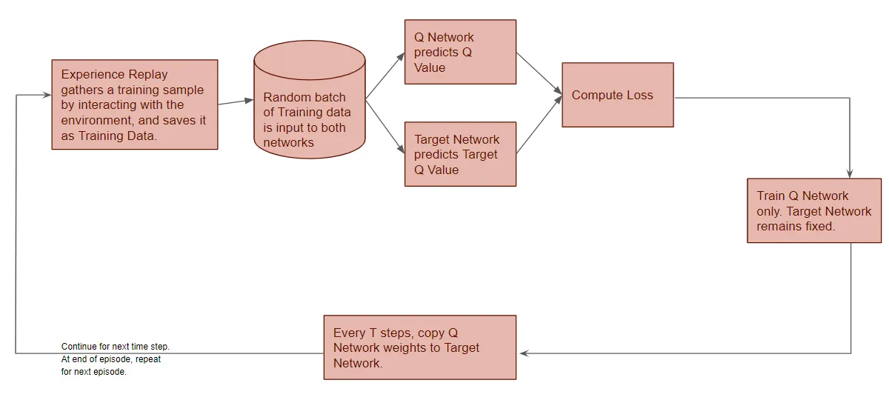  
<i>These operations are performed in each time-step.</i>

1. Experience Replay: selects an epsilon-greedy action from current state and executes it in the environemnt, gets back the reward and the next state and saves this observation as a sample of training data
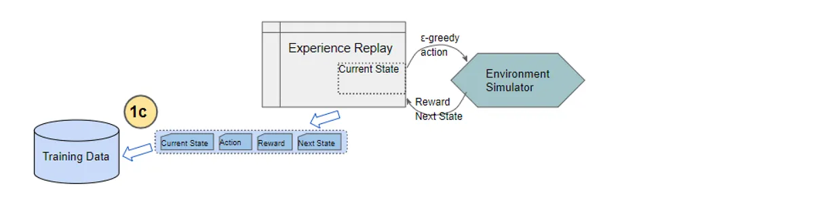
2. With training data (prior saved Experience Reply observation)
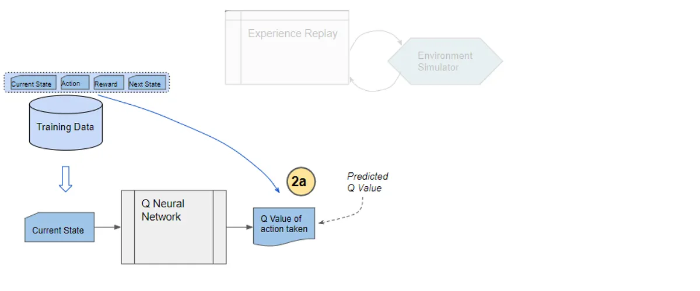
3. Target network predicts the Target Q-value: takes the enxt state frome ach data sample and predicts the best Q value out of all actions
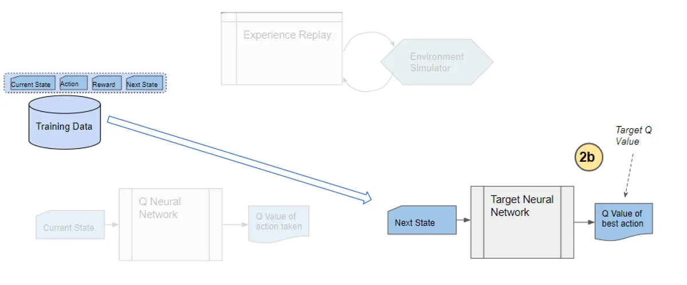
4. Computes the loss from Target Q value, Predicted Q Value and observed reward to compute the loss to train the Q network (Target Network is not trained). 
Loss = MSE(Predicted Q-value, Target Q-value)

**DQN in depth**
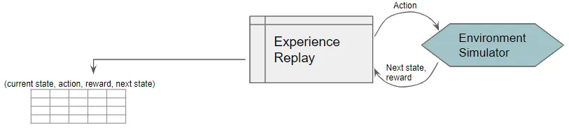
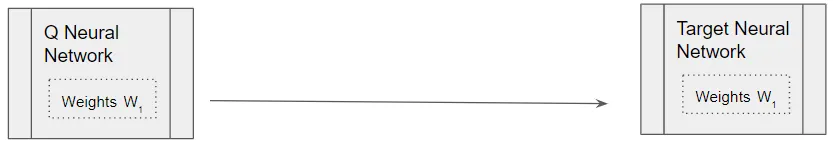<i>Initialize QNN and copy them into T-QNN.</i>
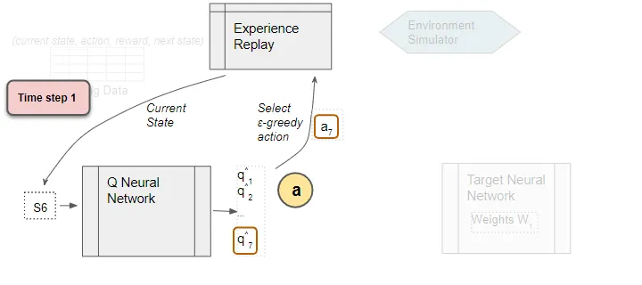
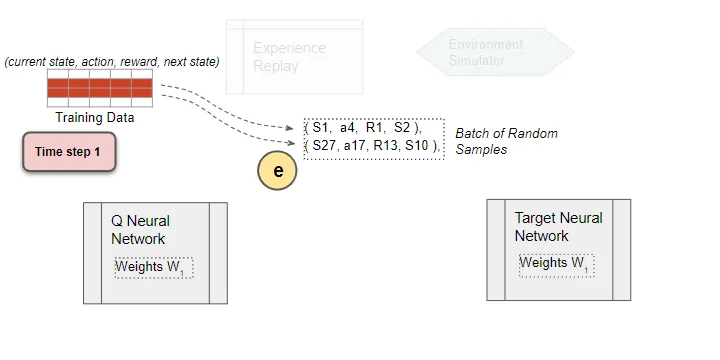<i>Select a random training batch.</i>
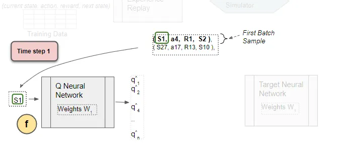
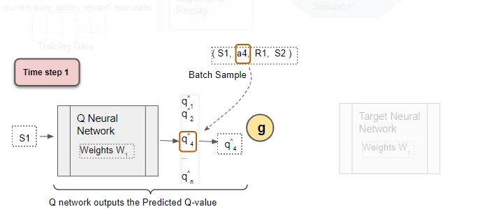<i>Select Q values of the sample action.</i>
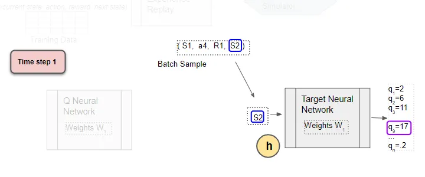<i>Use next state and input it into T-QNN and selects maximum of the Q values.</i>
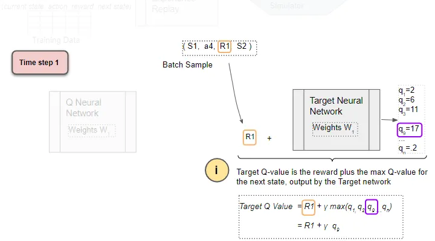
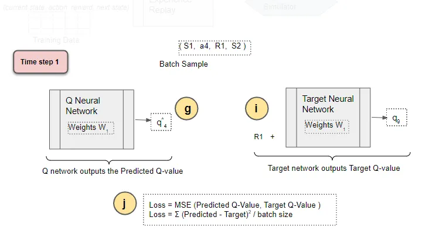
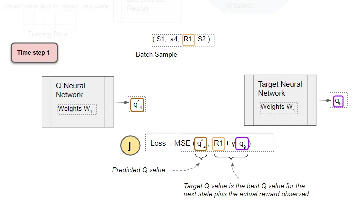
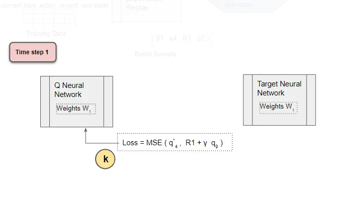<i>Backpropagate Loss to Q-Network.</i>
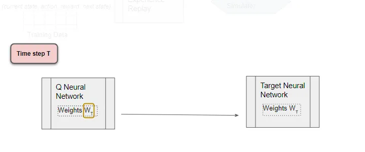<i>After T time step, copy weights from QNN to TQNN.</i>

